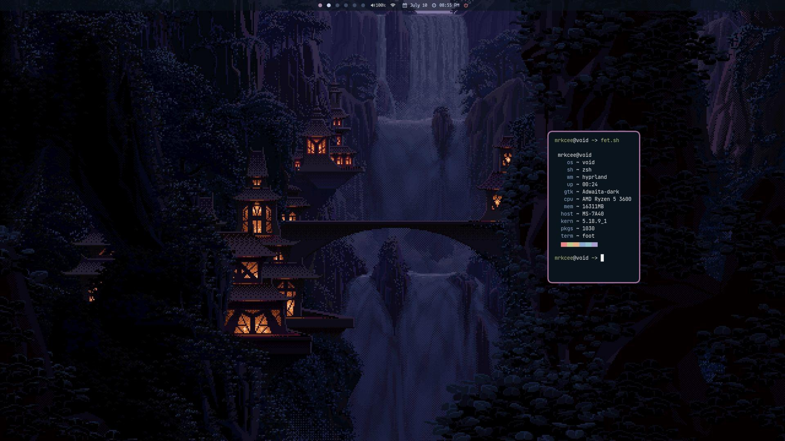

# hyprland-dotfiles
Personal .config files for hyprland

Color theme based on [N3k0Ch4n's awm configs](https://github.com/N3k0Ch4n/dotRice).

### setup
- **WM**: [hyprland](https://github.com/hyprwm/hyprland)
- **Terminal**: [foot](https://codeberg.org/dnkl/foot)
- **Bar**: [yambar-mrkcee](https://codeberg.org/mrkcee/yambar)
- **Launcher**: [fuzzel](https://codeberg.org/dnkl/fuzzel)
- **Notification**: [mako](https://github.com/emersion/mako)
- **Fonts**: mononoki Nerd Font, JetBrains Mono
- **Shell**: zsh

### screenshots

### tested on:

AMD Ryzen 5 3600

AMD Radeon RX 5700 XT

Single Monitor setup

